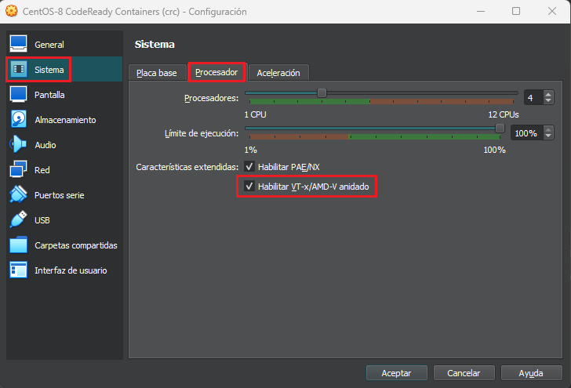
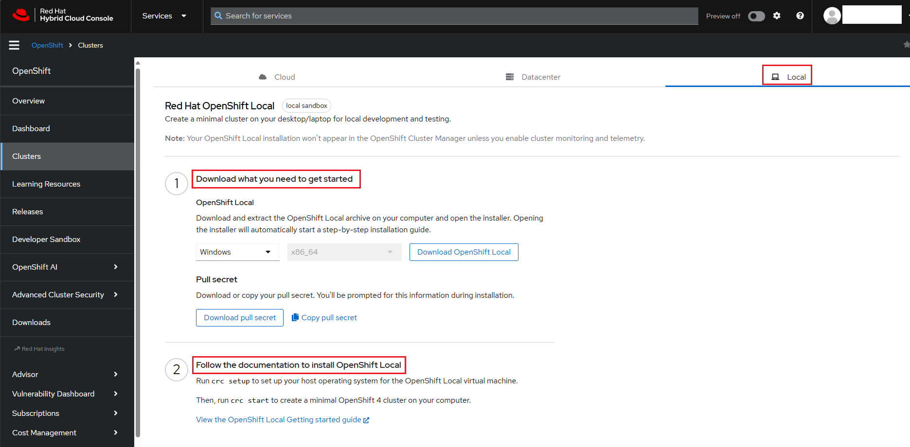
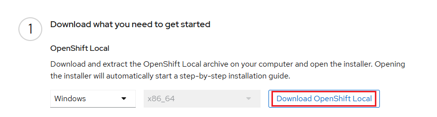
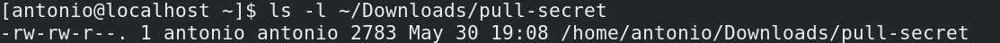
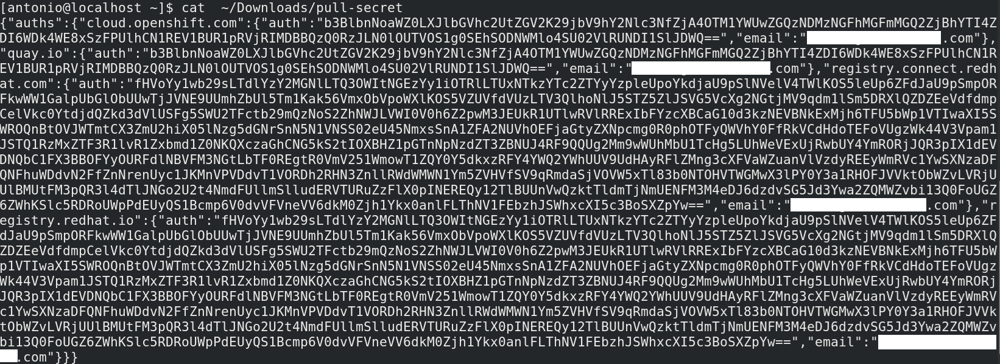

# Laboratorio 85-A: ***Instalación de CodeReady Containers en equipo de usuario***

`CodeReady Containers (crc)` es una herramienta de desarrollo proporcionada por Red Hat que permite a los desarrolladores ejecutar una versión ***local de OpenShift***, la plataforma de Kubernetes de Red Hat. Esta herramienta facilita la creación de entornos de desarrollo locales que son consistentes con los entornos de producción basados en OpenShift. 

CodeReady Containers ha sido renombrado a `OpenShift Local`, aunque es la misma herramienta. Sigue proporcionando una manera sencilla de ejecutar un clúster de OpenShift en una máquina local para facilitar el desarrollo y las pruebas.

## Características principales de CodeReady Containers:

1. **Despliegue Local de OpenShift**: Permite a los desarrolladores desplegar una instancia de OpenShift en sus máquinas locales, facilitando el desarrollo y pruebas de aplicaciones en un entorno similar al de producción.

2. **Fácil Configuración y Uso**: Simplifica el proceso de configuración y uso de OpenShift, proporcionando un entorno preconfigurado que incluye todos los componentes necesarios.

3. **Optimización para Desarrollo**: Está optimizado para el desarrollo de aplicaciones, con herramientas y recursos preconfigurados para acelerar el ciclo de desarrollo.

4. **Compatibilidad con Kubernetes**: Dado que OpenShift se basa en Kubernetes, los desarrolladores pueden beneficiarse de todas las características y capacidades de Kubernetes, además de las mejoras específicas de OpenShift.

## Beneficios de usar CodeReady Containers:

- **Consistencia entre Entornos**: Ayuda a mantener la consistencia entre los entornos de desarrollo, prueba y producción, lo que reduce los problemas relacionados con la configuración y las dependencias.

- **Productividad del Desarrollador**: Al proporcionar un entorno local similar al de producción, se reduce el tiempo necesario para configurar y gestionar entornos de desarrollo, permitiendo a los desarrolladores centrarse en el código.

- **Facilita la Adopción de OpenShift**: Para equipos que ya están usando o planean usar OpenShift en producción, CodeReady Containers es una herramienta ideal para familiarizarse con la plataforma y sus características.


Requisitos:

1. Una máquina virtual con `CentOS 8` o superior. `100 GB` de disco disponible. `4 cores` y `14 GB` de RAM.

Nota: `crc` requiere 11.3 GB de RAM, pero es conveniente dotar a la VM de algo más, por eso recomendamos 14 GB.

2. La VM de VirtualBox debe tener la virtualización anidada activada. Esta configuración se repasa en el primer ejercicio del laboratorio.


## Ejercicio 1: Habilitación de la ***virtualización anidada*** en la VM CentOS 8.

Como requisito fundamental, la VM donde estamos configurando `crc` necesita que la virtualización de segundo nivel o anidada esté activa. Para ello debemos comprobar que la casilla de verificación correspondiente esté marcada, tal y como muestra la siguiente imagen.



Puede ocurrir tres escenarios:

1. La casilla de verificación está seleccionada. En este caso no debemos hacer nada. Pasamos al siguiente ejercicio.

2. La casilla de verificación no está seleccionada y no está deshabilitada. En este caso debemos activarla. Pasamos al siguiente ejercicio.

3. La casilla de verificación no está seleccionada y se ***encuentra deshabilitada***. Aquí debemos hacer una intervención manual en VirtualBox para conseguir habilitar la virtualización anidada. Los pasos a realizar son los siguientes.

Abrir una terminal en la carpeta de instalación de VirtualBox, habitualmente `C:\Program Files\Oracle\VirtualBox`. 

Ejecutar el siguiente comando, ajustando en nombre de la VM a conveniencia.
```
.\VBoxManage.exe modifyvm "Centos-8 OpenShift Local (crc)" --nested-hw-virt on
```
Una vez hecho esto, y con la VM apagada, podemos acceder y activar la casilla de verificación de


## Ejercicio 2: Instalación de ***OpenShift local*** 

Procedemos a instalar actualizar los paquetes de CentOS.

```
su -
```

```
dnf update -y
```

Procedemos a instalar las depencencias. Estas son:

- `Network Manager`: Es una utilidad de software diseñada para simplificar la gestión de redes en sistemas operativos Linux. NetworkManager puede detectar automáticamente las redes disponibles y conectarse a la red más apropiada basada en la configuración y las preferencias del usuario. Permite la conmutación automática entre redes inalámbricas y cableadas. Proporciona tanto herramientas de línea de comandos (`nmcli`) como interfaces gráficas (`nm-applet` y configuraciones en entornos de escritorio para `GNOME` y `KDE`).

- `libvirt`: Es una colección de herramientas y una API diseñada para gestionar plataformas de virtualización. Proporciona una interfaz unificada para interactuar con diversos hipervisores incluido `VirtualBox`, permitiendo a los usuarios crear, modificar y controlar máquinas virtuales y recursos asociados de manera eficiente. 

```
sudo dnf install NetworkManager libvirt -y
```

Es el momento de descargar los paquetes de OpenShit. Para ello necesitamos disponer de una cuenta en RedHat.

A continuación nos conectamos a la consola. Con el navegador, conectamos con la siguiente URL.
```
https://console.redhat.com/openshift/create/local
```

Aparecerá una página con las instrucciones de instalación. 



Hacemos clic en el botón `Download OpenShift Local`, indicado en la siguiente imagen. 



Asumiendo que el archivo se ha descargado en `Downloads`, ejecutamos los siguientes comandos:

```
cd ~/Downloads/
```

```
tar -xvf crc-linux-amd64.tar.xz 
```

El ejecutable es `crc`. Vamos a copiarlo a una ruta dentro de `$PATH`.

```
sudo cp ~/Downloads/crc-linux-*-amd64/crc /usr/local/bin/crc
```

Lo hacemos ejecutable 
```
sudo chmod +x /usr/local/bin/crc
```

Comprobamos que sea ejecutable.
```
ls -l /usr/local/bin/crc
```


Ahora debemos descargar el `Pull secret`. Básicamente es la información de autenticación que necesitaremos para conectar con el cluster. Hacemos clic en el botón correspondiente.


Comprobamos que se ha descargado el secreto.
```
cd ~
```

```
ls -l ~/Downloads/pull-secret 
```



Si tienes curiosidad, puedes ver su contenido.
```
cat  ~/Downloads/pull-secret 
```

Obtendrás algo como esto.



Vamos a mover el secreto al directorio `home` para no perderlo.
```
mv ~/Downloads/pull-secret ~
```


Ahora debemos configurar `crc`. Para ello vamos a iniciarlo, y decidir si habilitamos o no la recolección de datos para enviarlos a RedHat. En este escenario decidimos que sí.
```
crc config set consent-telemetry yes
```

Es el momento de utilizar la herramienta de configuración de `crc` para descargarnos en nuestro equipos los archivos de `OpenShift Local`.

Nota: Tardará aproximadamente 10-15 minutos.

```
crc setup
```


 

https://www.youtube.com/watch?v=skOohvvPBys
