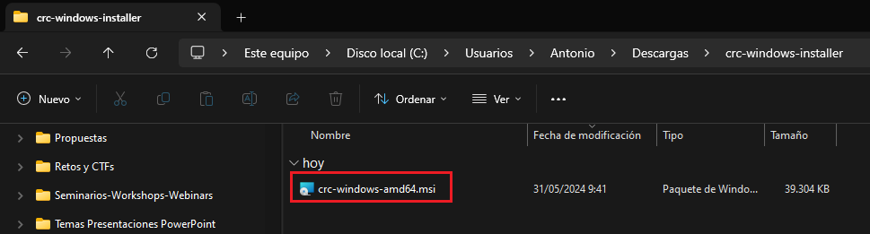
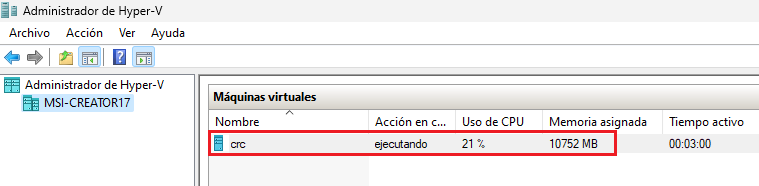

# Laboratorio 85-A: ***Instalación de CodeReady Containers en equipo de usuario***

`CodeReady Containers (crc)` es una herramienta de desarrollo proporcionada por Red Hat que permite a los desarrolladores ejecutar una versión ***local de OpenShift***, la plataforma de Kubernetes de Red Hat. Esta herramienta facilita la creación de entornos de desarrollo locales que son consistentes con los entornos de producción basados en OpenShift. 

CodeReady Containers ha sido renombrado a `OpenShift Local`, aunque es la misma herramienta. Sigue proporcionando una manera sencilla de ejecutar un clúster de OpenShift en una máquina local para facilitar el desarrollo y las pruebas.

## Características principales de CodeReady Containers:

1. **Despliegue Local de OpenShift**: Permite a los desarrolladores desplegar una instancia de OpenShift en sus máquinas locales, facilitando el desarrollo y pruebas de aplicaciones en un entorno similar al de producción.

2. **Fácil Configuración y Uso**: Simplifica el proceso de configuración y uso de OpenShift, proporcionando un entorno preconfigurado que incluye todos los componentes necesarios.

3. **Optimización para Desarrollo**: Está optimizado para el desarrollo de aplicaciones, con herramientas y recursos preconfigurados para acelerar el ciclo de desarrollo.

4. **Compatibilidad con Kubernetes**: Dado que OpenShift se basa en Kubernetes, los desarrolladores pueden beneficiarse de todas las características y capacidades de Kubernetes, además de las mejoras específicas de OpenShift.

## Beneficios de usar CodeReady Containers:

- **Consistencia entre Entornos**: Ayuda a mantener la consistencia entre los entornos de desarrollo, prueba y producción, lo que reduce los problemas relacionados con la configuración y las dependencias.

- **Productividad del Desarrollador**: Al proporcionar un entorno local similar al de producción, se reduce el tiempo necesario para configurar y gestionar entornos de desarrollo, permitiendo a los desarrolladores centrarse en el código.

- **Facilita la Adopción de OpenShift**: Para equipos que ya están usando o planean usar OpenShift en producción, CodeReady Containers es una herramienta ideal para familiarizarse con la plataforma y sus características.

En esta URL: https://access.redhat.com/documentation/en-us/red_hat_openshift_local/2.4/html/getting_started_guide/index tienes la documentación del producto.


Requisitos:

1. Una máquina `física` con `Windows 10 Fall Creators Update (version 1709)` o posterior. No se soporta la edición `Home`. Para `OpenShift Local` se requieren `4 cores`, `9 GB` de RAM y `35 GB` de disco. Para el runtime `Podman` se necesitan `2 cores`, `2 GB` de RAM y `35 GB`de disco. En consecuencia, los recursos mínimos son: `6 cores`, `12 GB` RAM y `70 GB` disco.


2. OpenShift local no soporta la virtualización anidada, por lo que no puede instalarse en una VM guest y se requiere instalación en el dispositivo físico. Para Windows se requiere la característica `Hyper-V`. El asistente de instalación creará una VM en Hyper-V que hospeda los servicios de OpenShift Local.


## Ejercicio 1: Instalación de ***OpenShift local*** 

En primer lugar debemos asegurarnos que el usuario con el que hemos iniciado sesión en Windows es miembro del grupo `Administradores de Hyper-V`. Para ello, abrimos la consola de `administración de equipos` y hacemos doble clic en el usuario apropiado.


y lo agregamos al grupo `Administradores de Hyper-V`.


En la terminal, comprobamos que somos miembros del grupo.
```
net localgroup
```

El resultado debe ser similar al mostrado en la siguiente imagen.


Es el momento de descargar los paquetes de OpenShit. Para ello necesitamos disponer de una `cuenta en RedHat`.

A continuación nos conectamos a la consola. Con el navegador, conectamos con la siguiente URL.
```
https://console.redhat.com/openshift/create/local
```

Hacemos clic en el botón `Download OpenShift Local`, indicado en la siguiente imagen. 


Se descargará el instalador `crc-windows-installer.zip` en la carpeta `Descargas`


Ahora debemos descargar el `pull secret`. Básicamente es la información de autenticación que necesitaremos para conectar con el cluster. Hacemos clic en el botón correspondiente.


En la carpeta `Descargas` tenemos el `pull secret` y el instalador, que está comprimido.


Descomprimimos el instalador.

Si tienes curiosidad, puedes ver el contenido del `pull secret`.


Obtendrás algo como esto.


Vamos a mover el secreto a un directorio mejor para que no se pierda. Elige el directorio que más te guste.

Una vez descomprimido el instalador, verás el correspondiente archivo `msi`.




Ejecútalo y sigue los pasos del asistente.


Al finalizar la instalación debemos `reiniciar el equipo`.


Ahora debemos configurar `crc`. Para ello vamos a iniciarlo, y decidir si habilitamos o no la recolección de datos para enviarlos a RedHat. En este escenario decidimos que sí. En una terminal de comandos, escribimos.
```
crc config set consent-telemetry yes
```

Es el momento de utilizar la herramienta de configuración de `crc` para descargarnos en nuestro equipos los archivos de `OpenShift Local`.

Nota: Tardará aproximadamente 10 minutos.

```
crc setup
```
El asistente realizará unas comprobaciones previas, descargará y descomprimirá la VM de OpenShift Containers.


Es el momento de iniciar el cluster, para ello usamos el siguiente comando.
Nota: Tarda unos 10 minutos. 
```
crc start -p "C:\Users\Antonio\OneDrive - AVANTE FORMACION\Cursos\Containers\Openshift\pull-secret.txt"
```

Se crea la VM eh Hyper-V y se inicarán los servicios del cluster.



Como anunciamos, se requieren 4 cores.


Cuando el cluster sea estable, se mostrará la información de conexión, tal y como podemos ver en la siguiente imagen.


