# Laboratorio 85-B: ***Desplegar la aplicación de parques naturales en crc***.

La aplicación `national-parks` de OpenShift es un ejemplo de aplicación diseñada para demostrar las capacidades de la plataforma OpenShift, que es una solución de Kubernetes empresarial desarrollada por Red Hat. Esta aplicación suele ser utilizada en tutoriales, demostraciones y talleres para mostrar cómo desplegar, gestionar y escalar aplicaciones en un entorno OpenShift. 

La aplicación "national-parks" tiene como objetivo demostrar el uso de OpenShift. A través de esta aplicación, los usuarios pueden aprender sobre el despliegue de contenedores, la configuración de pipelines CI/CD, el escalado automático, la gestión de recursos y otros aspectos de OpenShift.

Las tecnologías involucradas son: 
   - **Contenedores Docker**: La aplicación está empaquetada en contenedores Docker, lo que permite una fácil implementación y escalabilidad en OpenShift.
   - **OpenShift Templates y Operators**: Utiliza plantillas y operadores de OpenShift para facilitar el despliegue y la gestión de la aplicación.
   - **CI/CD**: Puede incluir pipelines de CI/CD (Integración Continua / Despliegue Continuo) para demostrar cómo automatizar la construcción, prueba y despliegue de la aplicación.


Requisitos:

Una instancia en ejecución de local.


## Ejercicio 1: Conectar a la consola web.

Iniciamos sesión en la consola web de OpenShift Container Platform con nuestras credenciales de inicio de sesión. Conectamos a la siguiente URL, e iniciamos sesión con las credenciales de administrador.
```
https://console-openshift-console.apps-crc.testing
```

Nos redirigirá a la página Proyectos. Para los usuarios no administradores, la vista predeterminada es la `perspectiva del desarrollador`. Para los administradores de clústeres, la vista predeterminada es la `perspectiva Administrador`. Si no tenemos privilegios en el cluster, no veremos la perspectiva de administrador en la consola web.

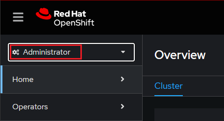


La consola web proporciona dos perspectivas: la perspectiva del administrador y la perspectiva del desarrollador. La perspectiva del desarrollador proporciona flujos de trabajo específicos para los casos de uso del desarrollador. La perpectiva de administrador permite desplegar aplicaciones y administrar el cluster.


## Ejercicio 2: Creación de un proyecto.

Los `proyectos` son extensiones de OpenShift Container Platform a los `espacios de nombres` de Kubernetes. 

Los usuarios ***deben recibir acceso a los proyectos*** por parte de los administradores. Los administradores de clústeres pueden permitir que los desarrolladores creen sus propios proyectos. En la mayoría de los casos, los usuarios tienen acceso automáticamente a sus propios proyectos.

Cada proyecto tiene su propio conjunto de `objetos`, `políticas`, `restricciones` y `cuentas de servicio`.

En la consola web de OpenShift Container Platform, elegimos la `perspectiva del desarrollador`.

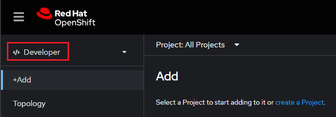

Hacemos clic en 'Create Project'. Aparecerá el formulario de creación de proyecto. En él aportamos la siguiente información.

En ***Name*** escribimos:
```
user-getting-started
```

En ***Display name***:
```
Getting Started with OpenShift
```

***Description*** lo dejamos vacío y hacemos clic en el botón `Create`.

Con esto finaliza la creación del proyecto de OpenShift.

## Ejercicio 3: Revisión de los permisos.

OpenShift Container Platform crea automáticamente algunas `cuentas de servicio` especiales en cada proyecto.

Una `cuenta de servicio` en OpenShift es una identidad especial que se utiliza para ejecutar `pods` dentro de un proyecto (o namespace) y para otorgar permisos específicos a aplicaciones y servicios que se ejecutan en esos pods. A diferencia de las cuentas de usuario normales, las cuentas de servicio no están vinculadas a personas individuales sino a aplicaciones o componentes de la infraestructura, permitiendo un control granular sobre los permisos y roles necesarios para que estas aplicaciones accedan a recursos específicos dentro del cluster de OpenShift. Esto facilita la gestión segura y eficiente de los recursos y operaciones automatizadas en el entorno de contenedores.

La cuenta de servicio `predeterminada` asume la responsabilidad de ejecutar los pods. OpenShift Container Platform usa e inserta esta cuenta de servicio en cada pod que inicia.

La práctica que vamos a hacer crea un objeto `RoleBinding` para el objeto de cuenta de servicio predeterminado. La cuenta de servicio se comunica con la API de OpenShift Container Platform para obtener información sobre los pods, los servicios y los recursos del proyecto.

Cambiamos a la `perspectiva de administrador`.

Elegimos la opción `RoleBindings`

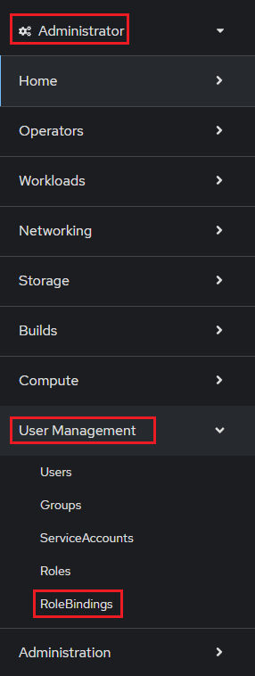

En la imagen puedes ver que ya existen una cantidad importante de RoleBindings en el cluster. Hacemos clic en `Create binding`.

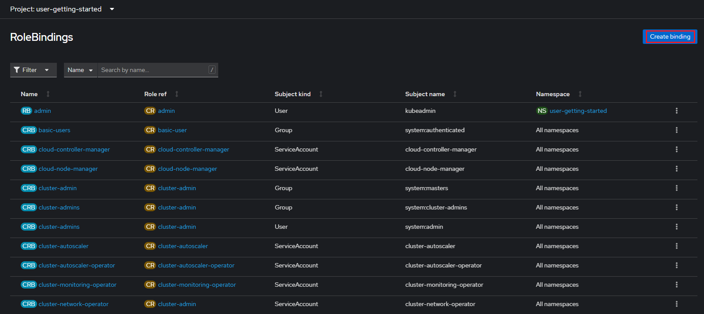

Rellenamos el formulario con la siguiente formación.

En ***Name***:
```
sa-user-account
```

La denominación `sa` en `sa-user-account `proviene de la abreviatura de ***Service Account***.

En ***Namespace*** buscamos nuestro proyecto, que se llama:
```
user-getting-started
```

En ***Role name*** buscamos `view` y seleccionamos ese rol.
```
view
```

En ***Subject*** seleccionamos `ServiceAccount`.

En ***Subject namespace*** buscamos y seleccionamos:
```
user-getting-started
```

En ***Subject name*** escribimos:
```
default
```

Por último hacemos clic en `Create`.

El resultado debe ser el siguiente:

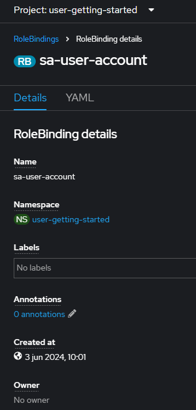

la vista `YAML` permite visualizar la definición del objeto creado en el cluster.

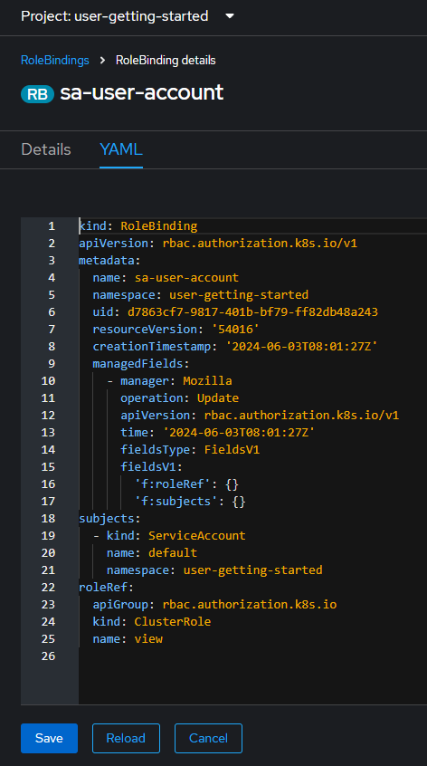

## Ejercicio 4: Desplegar una imagen de contenedor.

La forma más sencilla de implementar una aplicación en OpenShift Container Platform es ejecutar una imagen de contenedor existente. En la práctica siguiente, implementamos un componente ***front-end*** de una aplicación denominada `national-parks-app`. La aplicación web ofrece un mapa interactivo donde se muestra la ubicación de los principales parques nacionales del mundo.

Nos aseguramos de estar en la `perspectiva desarrollador` (Developer).

Como lo que deseamos hacer es elegir una imagen de contenedor, seleccionamos `Container images` desde la consola web.

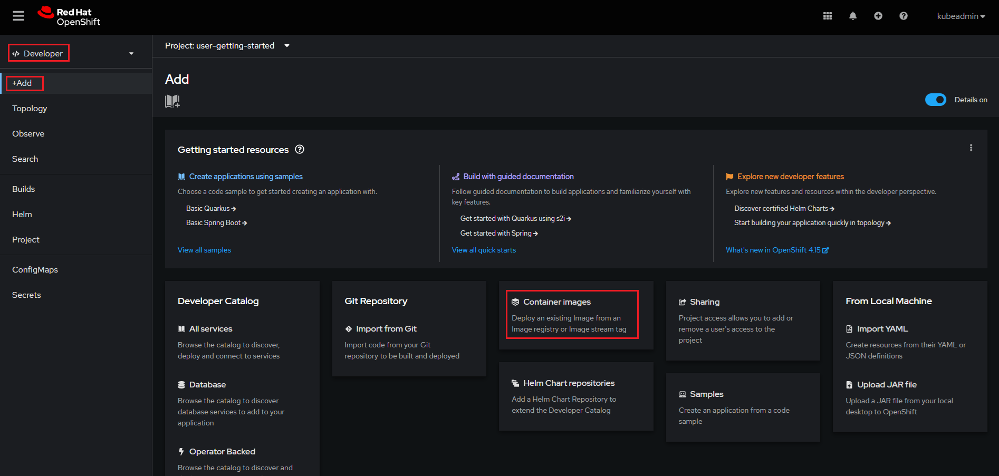

Rellenamos el formulario con la siguiente información.

En ***Image Name***, escribimos la ruta de la siguiente imagen:
```
quay.io/openshiftroadshow/parksmap:latest
```

Se realizará una verificación. 

En el desplegable `Runtime icon` podemos elegir el icono de nuestra elección.

Comprobar que en la sección `General` aparece la siguiente información:

Nota: Es posible cambiar estos valores a los que necesitemos.

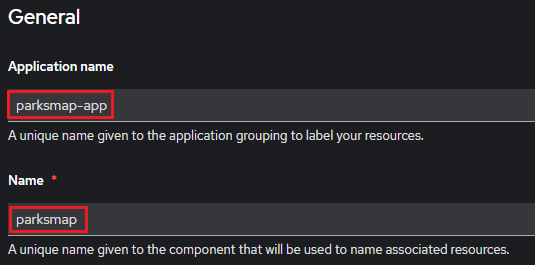

En la sección `Deploy` debemos comprobar que la imagen seleccionada se desplegará en un objeto `Deployment`de Kubernetes.

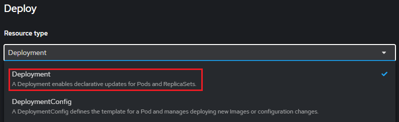

Nota: En OpenShift, la principal diferencia entre `Deployment` y `DeploymentConfig` radica en cómo gestionan las actualizaciones y despliegues de las aplicaciones. `Deployment` es un objeto nativo de Kubernetes que utiliza controladores y replicasets para gestionar el ciclo de vida de las aplicaciones, proporcionando características avanzadas como despliegues automáticos, rollbacks, y actualizaciones continuas. Por otro lado, `DeploymentConfig` es específico de OpenShift y ofrece funcionalidades adicionales como hooks de despliegue personalizados y una integración más estrecha con otras características de OpenShift, como las estrategias de despliegue personalizadas y las builds automáticas. Aunque `DeploymentConfig` proporciona más opciones de personalización, `Deployment` es más estándar y portable a cualquier clúster de Kubernetes.

Para que nuestra aplicación sea accesible, debemos crear una `Ruta`. 

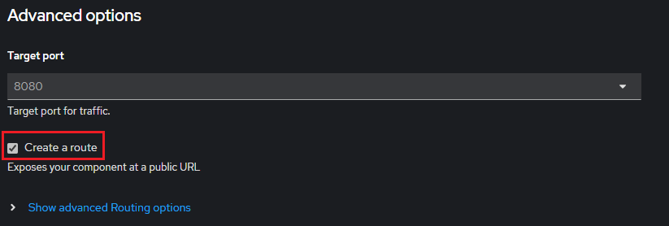

En OpenShift, el uso de las `etiquetas` (labels) es fundamental. Para ver las etiquetas asociadas a este despliegue, hacemos clic en el enlace `Labels`, tal y como podemos apreciar en la siguiente imagen.

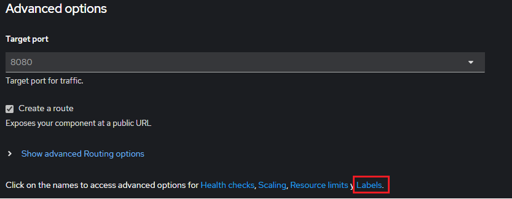

Añadimos las siguientes etiquetas:
```
app=national-parks-app
```
```
component=parksmap
```
```
role=frontend
```

Finalizamos la práctica haciendo clic en el botón `Create`.

La interfaz gráfica muestra el estado de implementación.

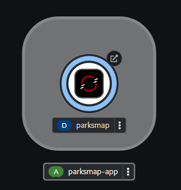

El circulo celeste cambiará a un color más oscuro cuando nuestro despliegue esté implementado.

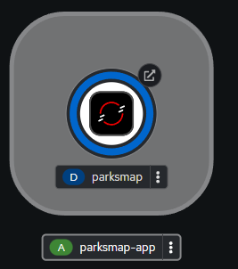

La interfaz gráfica muestra la página de `Topology`, donde podemos ver como el deployment `parksmap` se encuentra en la aplicación `parksmap-app`.

## Ejercicio 5: Examinar el pod.

OpenShift Container Platform aprovecha el concepto pod de Kubernetes, que como bien sabemos está formado por uno o más contenedores. El pod es la unidad más pequeña de planificación.

El panel Información general le permite acceder a muchas características de la implementación. Las pestañas Detalles y Recursos le permiten escalar los pods de la aplicación, comprobar el estado de la compilación, los servicios y las rutas. Este panel es accesible desde el icono en forma de triángulo que se puede observar en la imagen.

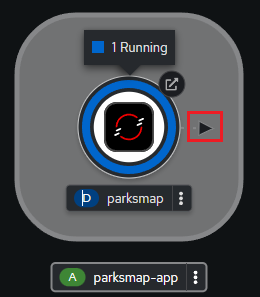

Al hacer clic en el triángulo, aparecerá el panel de información general.

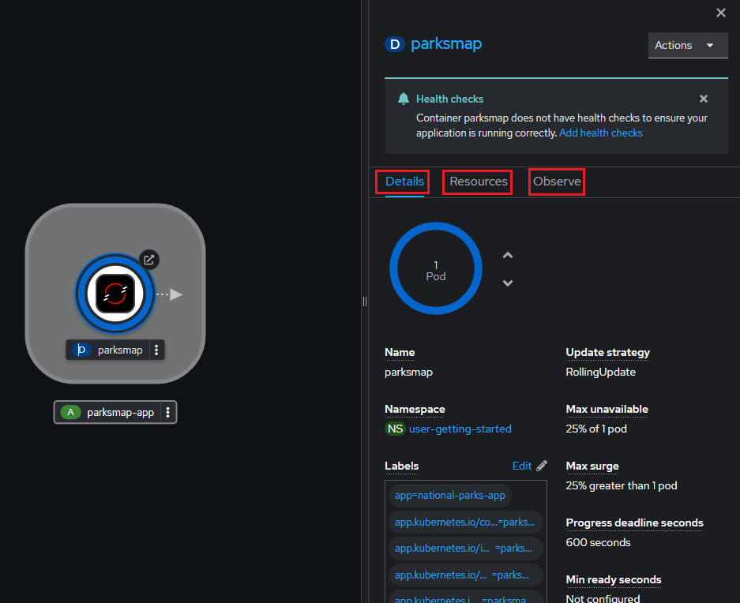

## Ejercicio 6: Escalar la aplicación.

En Kubernetes, un objeto `Deployment` define cómo se implementa una aplicación. En la mayoría de los casos, los usuarios usan `Pod`, `Service`, `ReplicaSets` y `Deployment`. OpenShift Container Platform es capaz de crear estos recursos por nosotros.

Al implementar la imagen `national-parks-app`, se crea un recurso de implementación. En este ejemplo, solo se implementa un solo `Pod`.

Vamos a escalar el deployment para que use dos pods.

Hacemos clic en la pestaña `Details` y a continuación utilizamos los controles para instanciar dos pods.

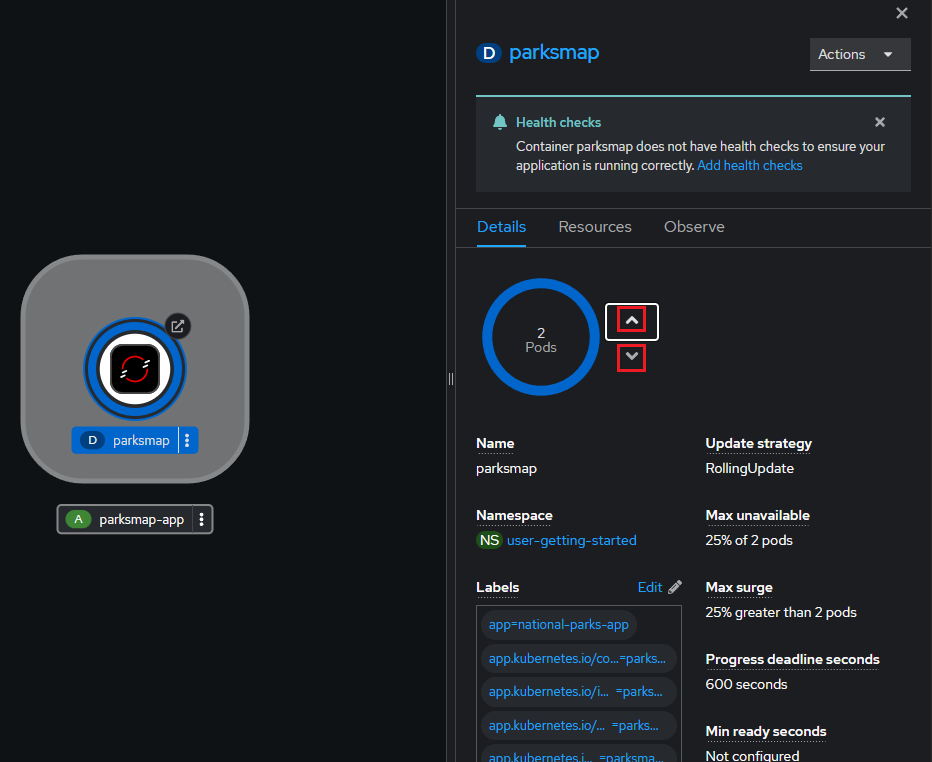

Volvamos a dejar una sola instancia en el despliegue.

## Ejercicio 7: Despliegue del servicio de backend.

A continuación vamos a proceder a desplegar un servicio back-end para la aplicación de parques naturales. El frontend de la aplicación realiza consultas a una base de datos MongoDB para localizar y devolver las coordenadas del mapa de todos los parques nacionales del mundo.

El servicio back-end implementado que es `nationalparks`.

Desde la perspectiva desarrollador, seleccionamos `+Add` y elegimos `Import from Git`. 

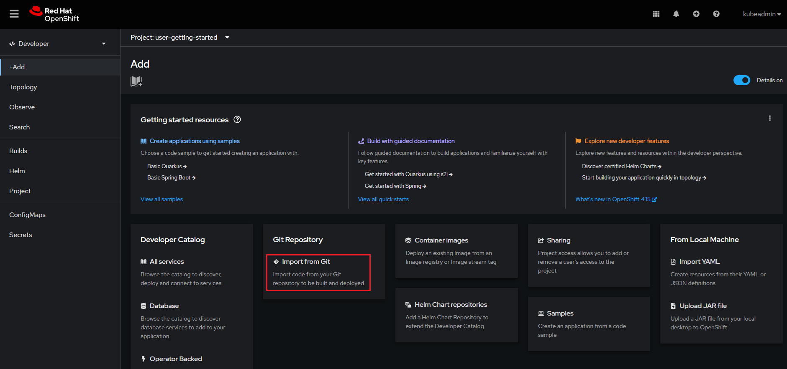

Escribimos la siguiente URL:

```
https://github.com/openshift-roadshow/nationalparks-py.git
```

Después de la validación, OpenShift detecta las diferentes formas o estrategias de importar la aplicación. 

IMPORTANTE: Si la estrategia recomendada es `Dockerfile`, debemos cambiarla. Para ello hacemos clic en el enlace `Edit Import Strategy`.

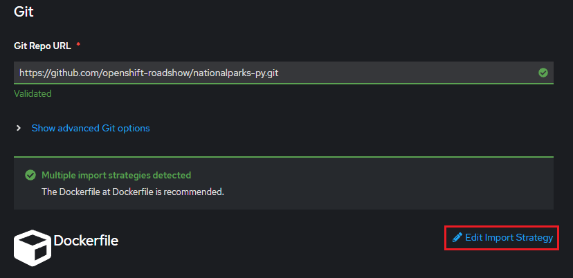

Seleccionamos `Builder Image` y luego `Python`.

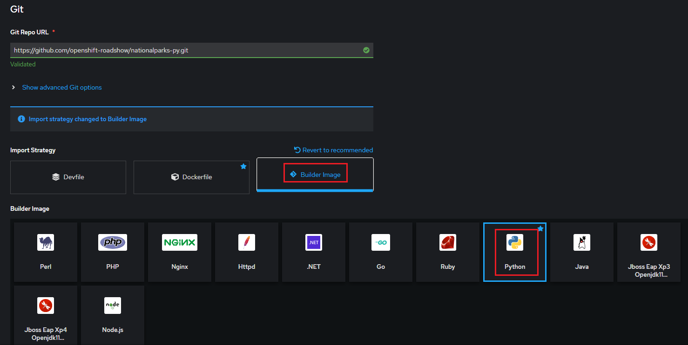

La elección entre importar una aplicación utilizando un `Dockerfile` o una `Builder Image` en OpenShift depende de las necesidades específicas del desarrollo y despliegue. Ambas tienen sus propias ventajas y casos de uso particulares.

### Dockerfile

**Ventajas**:
- **Flexibilidad**: Un Dockerfile ofrece un control total sobre el proceso de construcción de la imagen. Podemos definir cada paso de la compilación, desde la imagen base hasta la instalación de dependencias y la configuración final.
- **Transparencia**: Al usar un Dockerfile, todas las instrucciones para compilar la imagen están explícitas en el archivo, lo que facilita la auditoría y la replicación del proceso.
- **Portabilidad**: Las imágenes Docker construidas con Dockerfiles son portables a cualquier entorno que soporte Docker, no solo OpenShift.
- **Personalización**: Podemos optimizar la imagen para nuestras necesidades específicas, incluyendo la selección de la imagen base y las herramientas incluidas.

**Desventajas**:
- **Complejidad**: Requiere más conocimiento sobre Docker y la compilación de imágenes, lo que puede ser una barrera para principiantes.
- **Mantenimiento**: Necesitamos mantener y actualizar manualmente el Dockerfile conforme cambian los requisitos de la aplicación o las versiones de las dependencias.

### Builder Image

**Ventajas**:
- **Facilidad de uso**: Builder Images están preconfiguradas para construir y desplegar aplicaciones de manera rápida y eficiente, lo que reduce la necesidad de conocimientos avanzados sobre la construcción de imágenes Docker.
- **Estándar**: Red Hat y la comunidad proporcionan imágenes de builder estandarizadas y optimizadas para diferentes lenguajes y frameworks, asegurando buenas prácticas y configuraciones seguras.
- **Integración**: En OpenShift, Builder Images se integran estrechamente con Source-to-Image (S2I), facilitando la construcción automática de imágenes a partir del código fuente.

**Desventajas**:
- **Menos Flexibilidad**: Menor control sobre el proceso de compilación en comparación con un Dockerfile. Las personalizaciones están limitadas a lo que permite la imagen de builder.
- **Dependencia**: Dependencia de las actualizaciones y mantenimiento de la imagen de builder por parte de terceros (como Red Hat o la comunidad), lo que puede ser una limitación si necesitamos ajustes específicos.

### Comparación
- **Control vs. Conveniencia**: El `Dockerfile` ofrece mayor control y flexibilidad a costa de ser más complejo, mientras que las `Builder Images` proporcionan una solución más sencilla y rápida a cambio de una menor capacidad de personalización.
- **Caso de uso**: Utilizamos un Dockerfile cuando necesitamos control detallado sobre el entorno de compilación o cuando trabajamos con un entorno que no se ajusta a una Builder Image preexistente. Optamos por Builder Images cuando buscas una solución rápida y estandarizada para construir y desplegar la aplicación con menos esfuerzo inicial.


Revisamos el resto de opciones. Editamos las `Labels` y añadimos las siguientes:
```
app=national-parks-app
```
```
component=nationalparks
```
```
role=backend
```
```
type=parksmap-backend
```

Hacemos clic en el botón `Create`. La vista de `Topology` muestra los componentes que hemos desplegado.

La página de `Topology` muestra las dos capas de la aplicación.

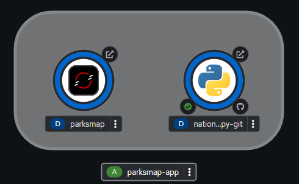

Si hacemos clic en las `Routes` del front-end, podemos obtener la URL de conexión. 

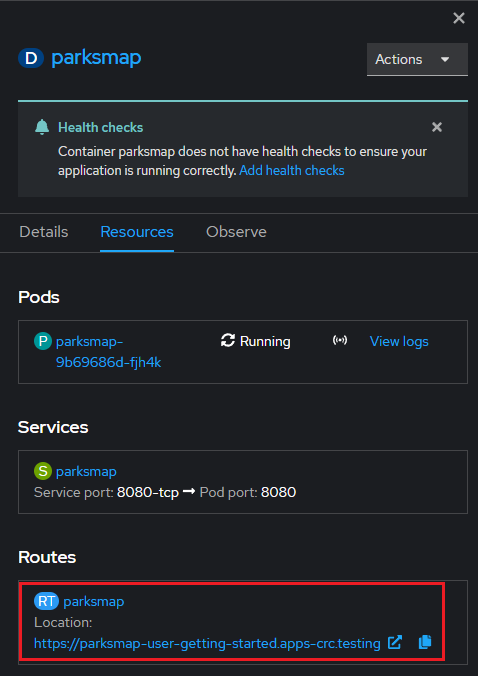

Al conectar con el navegador, observaremos que no hay conexión con los datos.

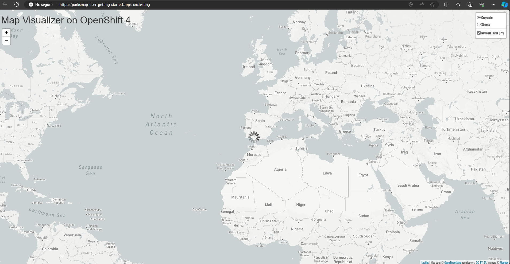

Es lógico, pues el backend que hemos desplegado no es la verdadera base de datos. Accedemos a su ruta.

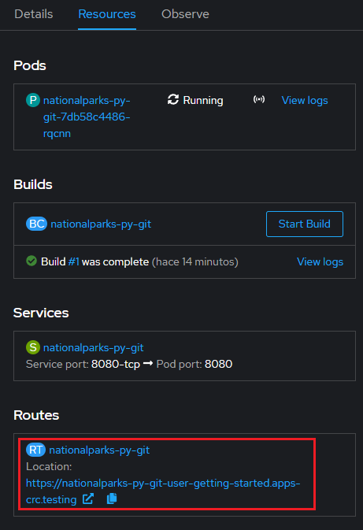

Se muestra un mensaje de bienvenida.

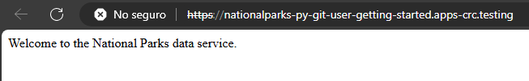

En realidad, es un servicio web, desde el cual, la verdadera base de datos MongoDB, cargará los datos.

Procedemos a desplegar MongoDB.

## Ejercicio 8: Conectar con la base de datos.

Desde la `Perspectiva de desarrollador` hacemos clic en `+Add` y posteriormente en `Container images`.

Rellenamos el formulario con la siguiente información:

En `Image Name`:
```
centos/mongodb-36-centos7
```

En `Runtime icon`, buscamos el de Mongo, para ello escribimos en el cuadro de búsqueda:
```
mongodb
```

En `Name` escribimos:
```
mongodb-nationalparks
```

Desplegamos la sección `Show advanced Deployment options` y creamos las siguientes parejas clave/valor como variables de entorno.

Nombre variable 1
```
MONGODB_USER
```

Valor
```
mongodb
```

Nombre variable 2
```
MONGODB_PASSWORD
```

Valor
```
mongodb
```

Nombre variable 3
```
MONGODB_DATABASE
```

Valor
```
mongodb
```

Nombre variable 4
```
MONGODB_ADMIN_PASSWORD
```

Valor
```
mongodb
```

Hacemos clic en el botón `Create`.

En la imagen podemos ver los tres componentes de la aplicación. De izquierda a derecha son:

- `parksmap`: Frontend de la aplicación.

- `mongodb-nationalparks`: Base de datos de la app.

- `nationalparks-py-git`: Servicio web desde el que se cargarán las tablas de la base de datos.

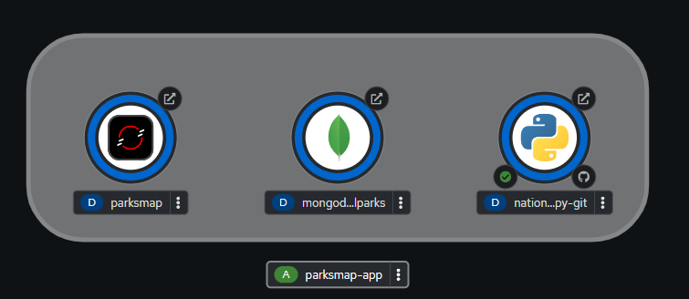


## Ejercicio 9: Creación del secreto.

Desde la `Perspectiva de desarrollador`, elegimos `Secrets` en el panel izquierdo y hacemos clic en el botón `Create` y elegimos `Key/value secret'.

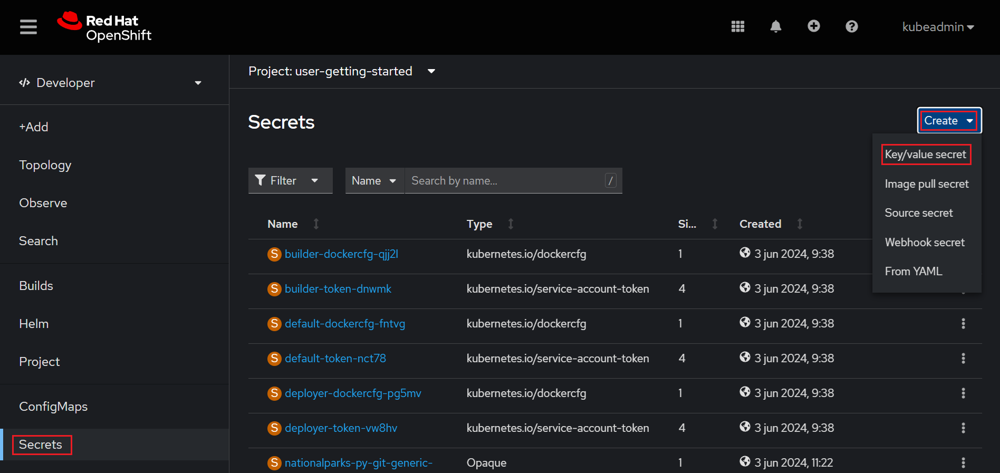

En `Secret name` escribimos:
```
nationalparks-mongodb-parameters
```

Añadimos las siguientes parejas clave/valor.

Nombre clave 1
```
MONGODB_USER
```

Valor
```
mongodb
```

Nombre clave 2
```
DATABASE_SERVICE_NAME
```

Valor
```
mongodb-nationalparks
```

Nombre clave 3
```
DMONGODB_PASSWORD
```

Valor
```
mongodb
```

Nombre clave 4
```
MONGODB_DATABASE
```

Valor
```
mongodb
```

Nombre clave 5
```
MONGODB_ADMIN_PASSWORD
```

Valor
```
mongodb
```

Hacemos clic en `Create`. 

Ahora hacemos clic en `Add Secret to workload`, con la idea de asignar el secreto al deployment. Seleccionamos `parksmap`. Hacemos clic en `Save`. OpenShift redesplegará el desployment para que lea los secretos a través de variables de entorno.

## Ejercicio 10: Cargar las tablas de la base de datos desde el servicio web.

La base de datos está creada, pero sus tablas vacías. Vamos a proceder a cargarlas.

Desde la vista `Topology`, navegamos hacia el deployment `nationalparks-py-git` y hacemos clic en `Resources` para obtener la ruta. La copiamos en el portapapeles.

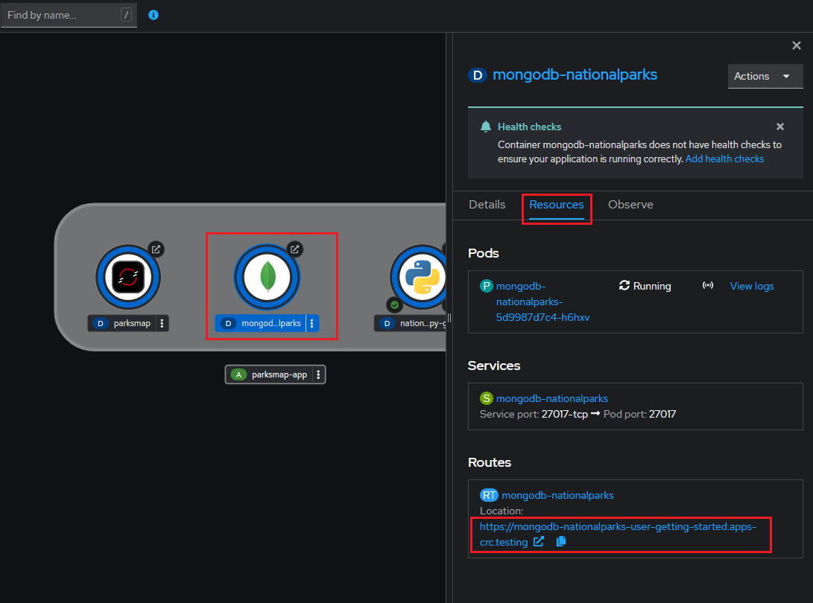

A continuación, pegamos el contenido del portapapeles en la barra de dirección del navegador, y al final, concatenamos lo siguiente:
```
/ws/data/load
```

Como resultado, el servicio insertará datos en la base de datos.

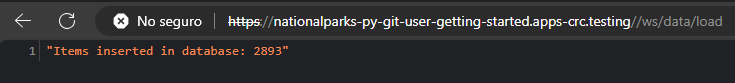


