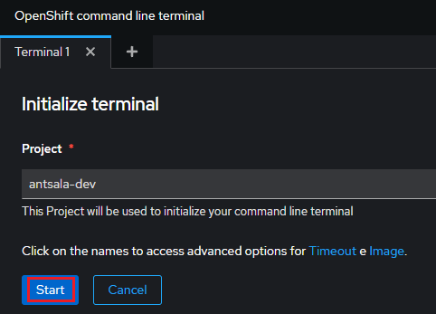

# Laboratorio 85-C: ***Uso de la cli de OpenShift***.

## La CLI de OpenShift: Control total de tu clúster desde la terminal

La `Interfaz de línea de comandos de OpenShift (CLI)`, también conocida como `oc`, es una herramienta fundamental para la gestión y administración de clústeres de OpenShift Container Platform (OCP). Esta  herramienta nos permite interactuar directamente con el cluster desde la terminal, permitiéndonos un control preciso sobre diversos aspectos, desde la creación y configuración de proyectos hasta el despliegue y administración de aplicaciones.

**Funcionalidades clave:**

* **Manejo de proyectos y aplicaciones:** Crea, elimina, modifica y visualiza proyectos dentro de tu clúster. Despliega, escala, monitoriza y elimina aplicaciones de forma sencilla.
* **Gestión de recursos:** Administra recursos como pods, imágenes, servicios, rutas y volúmenes en el clúster.
* **Automatización de tareas:** Automatiza tareas repetitivas y complejos flujos de trabajo mediante scripts y plantillas YAML.
* **Interacción con APIs:** Interactúa con las APIs de OpenShift para realizar tareas avanzadas.

Requisitos:

Una instancia en ejecución de OpenShift.


## Ejercicio 1: Instalación de la cli en la máquina del desarrollador.

Podemos instalar la `cli` de OpenShift (oc = OpenShift Cli) en `Linux`, `Windows` o `MacOS`.

Nota: Como OpenShift se actualiza automáticamente cada cierto tiempo, es conveniente reinstalar la cli de la misma forma. 

Para instalar la cli, realizamos el siguiente procedimiento:

Vamos a la página de descarga de OpenShift:
```
https://access.redhat.com/downloads/content/290
```

Seleccionamos la arquitectura de la lista 

En `Product Variant` seleccionamos ***Red Hat OpenShift Container Platform***.

En `Version` elegimos la última (***latest***).

En `Architecture` debe aparecer ***x86_64***.

Ahora hacemos clic en el botón `Download Now`para el producto `OpenShift Vx.x.x Windows Client`, o el que estimes oportuno para tu sistema operativo.


La descarga, para cualquiera de los sistemas operativos, es un archivo zip que contiene un ejecutable, que debemos colocar en un directorio que esté en el PATH. Descomprimimos en zip en la carpeta de descargas.

Para Windows, con el `Explorador de archivos`, creamos la siguiente carpeta: `C:\Archivos de programa\oc`

A continuación, movemos a dicha carpeta, el ejecutable `oc.exe` que debe estar en la carpeta de descargas.

Modifica la variable de entornos `PATH` para que contenga la nueva ruta.


Abrimos una terminal de `cmd`. Probamos que todo ha ido correctamente. En la terminal, escribimos.
Nota: El mensaje de error que indica que no puede conectar con el servidor en perfectamente normal, ya que aun no hemos indicado donde se encuentra el Control Plane de OpenShift.
```
oc version
```


Como alternativa, podemos descargar la cli desde la consola web de administración de OpenShift. 


La consola muestra enlaces para poder descargar la versión que más nos interese.


## Ejercicio 2: Conexión al Control Plane desde la cli.

Para poder conectar la cli debemos conocer la URL de la API Server. Para ello, desde la consola web, hacemos clic en el icono de la interrogación y seleccionamos `Command Line Tools`. Se mostrará un enlace con el comando de `login`.


Hacemos clic en él y nos logamos en el Servidor. Aparecerá una nueva pantalla que nos permite visualizar el token de conexión. 


Copia el comando de login y ejecútalo en tu terminal.

Si la conexión es correcta, verás un mensaje como el siguiente:


Pedimos información sobre los pods en ejecución.
```
oc get pods
```

Pedimos información sobre los nodos.
```
oc get nodes
```

Si te das cuenta, `oc` sigue la misma sintaxis que el comando `kubectl`. En consecuencia podemos usarla de la misma forma.

## Ejercicio 3: Uso de la cli desde la consola web.

Como alternativa a la instalación de la cli, podemos usarla directamente desde la consola web. Para ello hacemos clic en el icono en forma de prompt, tal y como muestra la imagen.


Se pide permiso para inicializar la terminal.



Hacemos clic en `Start`. Se desplegará la terminal de la cli.

Puedes probar a ejecutar comandos de `oc`.


A partir de este momento, puedes optar por usar la cli local o la terminal que ofrece la consola web.

## Ejercicio 4: Despliegue de la app nationalparks desde la cli

Una vez que hemos conectado la cli al servidor de Openshift, podemos realizar los despliegues usando exclusivamenta la línea de comandos. Vamos a volver a desplegar la aplicación de Parques Naturales.

En condiciones normales, debemos crear siempre un `project` por cada nueva aplicación que deseemos instalar. Recordemos que el concepto de proyecto es muy parecido al `namespace` de Kubernetes. El comando a ejecutar sería.
```
oc new-project user-getting-started --display-name="Getting Started with OpenShift"
```

Si estamos usando el sandbox gratuito, Red Hat no permite crear nuevos proyectos, y debemos usar el único proyecto disponible en el sandbox. Para listar los proyectos, escribimos
```
oc get projects
```

   

Si usas el sandbox, el nombre del proyecto tiene la forma de tu nombre de usuario de Red Hat y la extensión `-dev`. Este proyecto ya está seleccionado.

OpenShift Container Platform crea automáticamente algunas cuentas de servicio especiales en cada proyecto. La cuenta de servicio predeterminada `default` asume la responsabilidad de ejecutar los pods. OpenShift Container Platform usa e inserta esta cuenta de servicio en cada pod que se inicia.

Vamos a proceder a asignar el rol `view` a la cuenta de servicio `default` para el proyecto (espacio de nombres) `tu_usuario-dev`.
Nota: pon tu espacio de nombres (proyecto) en el comando.
```
oc adm policy add-role-to-user view -z default -n antsala-dev
```

Vamos a desplegar el front-end de la aplicación, que es un componente de la aplicación `national-parks-app`.
```
oc new-app quay.io/openshiftroadshow/parksmap:latest --name=parksmap -l "app=national-parks-app,component=parksmap,role=frontend,app.kubernetes.io/part-of=national-parks-app"
```

El front-end se ha desplegado.

   

Si accedes a la topología desde la consola, podrás comprobar como se va desplegando la aplicación.

   

Procedemos a crear la ruta. Como ya vimos una `route` permite a los clientes externos acceder a la aplicación del cluster. 

Mostramos los servicios para visualizar 
```
oc get service
```

Como podemos ver, el servicio `parkmap` es de tipo interno (`clusterIP`) y en consecuencia no se puede alcanzar desde fuera del cluster.

   

Creamos la ruta para exponer el servicio.
```
oc create route edge parksmap --service=parksmap
```

Mostramos las rutas.
```
oc get routes
```

   

Como podemos ver, la ruta mueve el tráfico hacia el servicio `parksmap`. También proporciona una DNS para poder conectar.

Visualizamos los pods de la aplicación.
```
oc get pods
```


Comprobamos que el pod del front-end está en `running`.

También podemos ejecutar comandos, al estilo de `kubectl`.
```
oc describe pods
```

Al igual que hicimos desde la consola web, procedemos a escalar el front-end a 2 instancias.
```
oc scale --current-replicas=1 --replicas=2 deployment/parksmap
```

```
oc get pods
```


Dejamos el front-end en 1 instancias.
```
oc scale --current-replicas=2 --replicas=1 deployment/parksmap
```

```
oc get pods
```

Vamos a desplegar el servicio de back-end. Es una aplicación de Python que realiza consultas contra una base de datos de MongoDB para localizar y devolver las coordenadas del mapa de los parques nacionales. El nombre del servicio será `nationalparks`.
```
oc new-app python~https://github.com/openshift-roadshow/nationalparks-py.git --name nationalparks -l "app=national-parks-app,component=nationalparks,role=backend,app.kubernetes.io/part-of=national-parks-app,app.kubernetes.io/name=python" --allow-missing-images=true
```

Creamos una ruta por si deseamos conectar con este servicio.
```
oc create route edge nationalparks --service=nationalparks
```

Mostramos las rutas.
```
oc get routes
```
Nota: Como `nationalparks` (el back-end) va a ser consumido por el `parksmap` (front-end) no sería estrictamente necesario crearle una ruta para que sea accesible desde fuera del cluster. 

Desplegamos la base de datos de MongoDB. Observemos cómo se inyectan las variables de entorno y se crean las etiquetas (labels)
```
oc new-app docker.io/centos/mongodb-36-centos7 --name mongodb-nationalparks -e MONGODB_USER=mongodb -e MONGODB_PASSWORD=mongodb -e MONGODB_DATABASE=mongodb -e MONGODB_ADMIN_PASSWORD=mongodb -l "app.kubernetes.io/part-of=national-parks-app,app.kubernetes.io/name=mongodb"
```


Creación del secreto. Necesario para que el front-end pueda conectar con la base de datos.
```
oc create secret generic nationalparks-mongodb-parameters --from-literal=DATABASE_SERVICE_NAME=mongodb-nationalparks --from-literal=MONGODB_USER=mongodb --from-literal=MONGODB_PASSWORD=mongodb --from-literal=MONGODB_DATABASE=mongodb --from-literal=MONGODB_ADMIN_PASSWORD=mongodb
```

Pasamos el secreto a los deployments que están en ejecución. Esto implican que los pods se reinicien para que puedan inyectarse las variables de entorno.
```
oc set env --from=secret/nationalparks-mongodb-parameters deploy/nationalparks
```

Para comprobar el estado de los despliegues ejecutamos:
```
oc rollout status deployment nationalparks
```

```
oc rollout status deployment mongodb-nationalparks
```

Cargar los datos en la base de datos. 

Para ello primero debemos localizar el pod de la aplicación de Python.
```
oc get pods
```

Localizamos el pod apropiado.


Ejecutamos en ese por el comando de carga de la base de datos.
Nota: Asegura que pones en identificador del pod correcto.
```
oc exec pod/nationalparks-f89c94ff5-7vdw5 -- curl -s http://localhost:8080/ws/data/load
```

Como resultado, debe aparecer un mensaje indicando que se han insertado datos.


Solo queda verificar que todo funciona. Para ello necesitamos obtener la URL del front-end.
```
oc get routes
```


En un navegador usamos la URL y probamos. Esta debe ser similar a esta:
```
parksmap-antsala-dev.apps.sandbox-m2.ll9k.p1.openshiftapps.com
```

