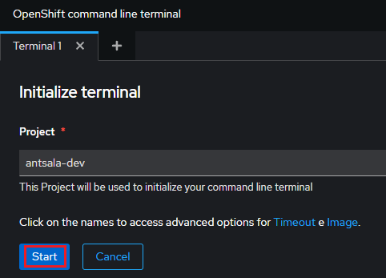
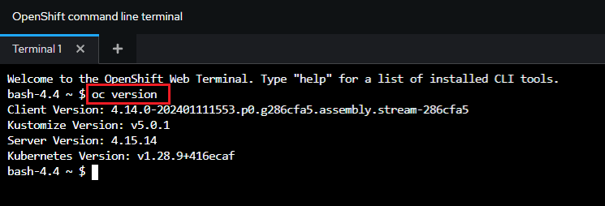

# Laboratorio 85-D: ***Despliegue de archivos YAML OpenShift***.

## Despliegue de archivos YAML.

El despliegue de archivos YAML a través de la CLI de OpenShift  `oc` ofrece una **manera eficiente y automatizada** de gestionar las aplicaciones y recursos en un clúster de OpenShift. Esta práctica proporciona **numerosos beneficios** que simplifican la administración y la escalabilidad de las cargas de trabajo en la nube.

Los archivos YAML definen la configuración de los recursos de OpenShift de forma declarativa, permitiendo una **descripción precisa y consistente** de los componentes de la aplicación. Al utilizar la CLI para desplegar estos archivos, se automatiza el proceso de creación y configuración, eliminando la necesidad de intervenir manualmente en cada paso. Esto garantiza la **repetibilidad** de los despliegues, asegurando que las aplicaciones se configuren de manera uniforme en diferentes entornos.

IMPORTANTE: Para poder realizar estas prácticas se necesitan permisos que no los suele dar Red Hat en el sandbox. Al tratarse una implementación multitenant no tenemos las credenciales de administrador del cluster y, en consecuencia, ciertas partes de esta práctica no se podrán realizar correctamente. Por esta razón, usaremos la implementación local de OpenShift.

Requisitos:

Una instancia en ejecución de OpenShift.


## Ejercicio 1: Clonado de respositorio para realizar prácticas y creación del proyecto.

Iniciamos sesión en la consola web de OpenShift Container Platform con nuestras credenciales de inicio de sesión. 

Si estás usando la implementación local, conectamos a la siguiente URL, e iniciamos sesión con las credenciales de administrador.
```
https://console-openshift-console.apps-crc.testing
```

Por el contrario, si usamos el sandbox, deberás conectar con la URL proporcionada por Red Hat, que es:
```
https://console.redhat.com/openshift/sandbox
```

A continuación abrimos la terminal de OpenShift desde la consola web. Para ello hacemos clic en el icono en forma de prompt, tal y como muestra la imagen.


Se pide permiso para inicializar la terminal.



Hacemos clic en `Start`. Se desplegará la terminal de la cli.

Puedes probar a ejecutar comandos de `oc`.



En la terminal escribimos el siguiente comando.
```
git clone https://github.com/antsala/OpenShift.git
```
En condiciones normales, debemos crear siempre un `project` por cada nueva aplicación que deseemos instalar. Recordemos que el concepto de proyecto es muy parecido al `namespace` de Kubernetes. El comando a ejecutar sería.
```
oc new-project user-getting-started --display-name="Getting Started with OpenShift"
```

Si estamos usando el sandbox gratuito, Red Hat no permite crear nuevos proyectos, y debemos usar el único proyecto disponible en el sandbox. Para listar los proyectos, escribimos
```
oc get projects
```

## Ejercicio 2: ***Descripción del sistema***

Vamos a hacer un despliegue de ***MongoDB*** y ***Mongo-Express*** usando archivos YAML.

MongoDB es el servidor de bases de datos que correrá en un contenedor dentro de un pod de OpenShift al que llamaremos ***mongodb-deployment***.

Mongo-Express es una ***interfaz gráfica de administración***, que se corre en su propio pod.

Con la idea de que el servidor MongoDB solo pueda ser administrado desde el pod de Mongo-Express implementaremos un servicio interno con nombre ***mongodb-service***.

Al crear el pod de MongoDB nos interesa aportar la credencial del usuario ***root***. La credencial la protegeremos mediante un ***secreto*** de OpenShift. Ver ***diapositiva 11*** `Despliegue de MongoDB-1`.

Mongo-Express tendrá su propio pod y deployment, y para conectar con MongoDB, necesitará la URL de la base de datos, así como una credencial (usuario y password). La URL la almacenaremos en un ***Config Map***, mientras que la credendial la leeremos desde el ***secreto***. Ver ***diapositiva 12*** `Despliegue de MongoDB-2`.

Por último, para hacer accesible al usuario la conexión al pod Mongo-Express, crearemos una `ruta` al ***servicio de monfo express***, del frontend. Ver ***diapositiva 13*** `Despliegue de MongoDB-3`.


# Ejercicio 2:  ***Crear la base de datos MongoDB***


Para MongoDB usaremos la imagen ***mongo*** presente en DockerHub. La documentación se encuentra en esta  URL: (https://hub.docker.com/_/mongo)

En consecuencia, a través de estas variables de entorno, podremos configurar las credenciales de la base de datos.

Nos posicionamos en el directorio de trabajo:
```
cd ~/OpenShift/85
```

Abrimos el archivo que contiene el deployment de MongoDB.
```
nano lab-85-D-mongodb.yaml
```

Lo primero que debemos asimilar es que este archivo está dividido en dos partes.La línea ***33*** tiene ***---***. En la sintaxis YAML esto indica que se está definiendo un objeto diferente. Por lo tanto, las líneas ***1-32*** definen el objeto ***mongodb-deployment***, mientras que las líneas ***34-44*** definen el objeto ***mongodb-service***.

Esta forma de definir los objetos es genial porque en un solo archivo tenemos todo lo necesario para que OpenShift despliegue el Backend.

El contenido de las líneas más relevantes del archivo YAML para el deployment es el siguiente:

* *Línea 2*: Indicamos que es un ***deployment***.
* *Línea 4*: De nombre ***mongodb-deployment***.
* *Línea 8*: El deployment tendrá un solo pod (***replicas: 1***)
* *Línea 16*: Empieza la definición de los contenedores que forman el pod (solo hay uno).
* *Línea 18*: El contenedor se llamará ***mongodb***.
* *Línea 19*: Y la imagen el ***mongo*** (https://hub.docker.com/_/mongo)
* *Línea 21*: El contenedor del servidor MongoDB trabaja en el puerto ***27017***.
* *Línea 22*: Importante. Es la primera vez que vamos a usar secretos de OpenShift inyectados a través de variables de entorno. La sección ***env:*** indica que vamos a definir variables de entorno. Estas las podrá leer la aplicación que corre en el contenedor cuando éste se inicie.
* *Línea 23*: La primera variable de entorno se llama ***MONGO_INITDB_ROOT_USERNAME***, que como vimos en la documentación (https://hub.docker.com/_/mongo) define el nombre de usuario administrador. Esta variable debe tener un valor. 
* *Línea 24 y 25*: Indicamos que dicho valor se va a tomar desde un secreto de OpenShift.
*  Línea 26*: Indicamos el nombre del secreto, en este ejemplo ***mongodb-secret***. Este secreto debe existir en el cluster y estará definido en otro archivo YAML que deberá implementarse antes que este.
* *Línea 27*: Un secreto puede contener una lista de parejas clave/valor. Por eso en esta línea indicamos el nombre de la clave ***mongodb-root-username***, cuyo valor contendrá el nombre de usuario a utilizar. Nótese que en el archivo YAML es del todo imposible conocer cual es ese nombre de usuario. El uso de secretos permite que el desarrollador no tenga porqué conocer esta información sensible. La unica persona que conocerá realmente este valor será el ***administrador del cluster***, que es quien crea los secretos. (Nota: en este ejercicio también tenemos el rol de administrador del cluster, por lo que tendremos que crear los secretos. Se verá en breve)
* *Líneas 28-32*: Se define la variable de entorno ***MONGO_INITDB_ROOT_PASSWORD***, que de forma similar a las líneas anteriores, servirá para almacenar el password de MongoDB.


Ahora procedemos a definir las líneas más relevantes del servicio interno.

* *Línea 35*: El objeto es un servicio.
* *Líneas 36 y 27*: En los metadatos vemos que aparece el nombre del servicio ***mongodb-service***, pero NO aparece el parámetro ***type: LoadBalancer***, por lo tanto es un ***servicio interno***.
* *Líneas 39 y 40*:   Se utiliza la etiqueta ***app: mongodb*** como selector. Esta etiqueta es la misma que se ha declarado en el deployment y en el pod.
* *Líneas 41-44*: Se usará protocolo de transporte TCP. El puerto externo del servicio es el ***27017*** y el tráfico sera reenviado al mismo puerto del (único) pod

Aun no podemos aplicar este archivo porque daría un error al no existir el secreto ***mongodb-secret***, por lo que procedemos a crearlo.


## Ejercicio 3:  ***Crear un secreto en OpenShift***.

Procedemos a crear el secreto que contendrá el usuario y el password de MongoDB.

OpenShift almacena los secretos codificados en ***Base64*** (no se cifran). Procedemos a generar las codificaciones para el nombre de usuario y la contraseña.
```
username=$(echo -n 'mongodb_admin' | base64)
password=$(echo -n '123WefRR' | base64)
```

Comprobamos el contenido de estas variables y las copiamos el algún sitio porque la necesitaremos en un instante.
```
echo $username
echo $password
```

Abrimos otra terminal, pues necesitaremos copiar de una y pegar en otra. En esta segunda terminal, cambiamos de directorio.
```
cd ~/OpenShift/85
```

En la segunda terminal, copiamos el archivo para no perder el original.
```
cp lab-85-D-mongodb-secret-initial.yaml lab-85-D-mongodb-secret.yaml
```

Seguimos en la segunda terminal. Editamos ***lab-85-D-mongodb-secret.yaml***
```
nano lab-85-D-mongodb-secret.yaml
```

Las líneas mas importantes y su significado son:

* *Línea 2*: El tipo de objeto a crear es un secreto de OpenShift.
* *Línea 4*: Aquí ponemos un nombre al secreto. En este caso ***mongodb-secret***. Los objetos que vayan a usarlo deberán poner este mismo nombre.
* *Línea 5*: OpenShift puede guardar secretos de diversa índole, por ejemplo, certificados digitales TLS, cadenas de conexión (URLs) y, en este caso, parejas clave/valor. A este tipo de información se le llama ***Opaque***.
* *Línea 7*: Esta línea contiene la clave del secreto para el NOMBRE del usuario. En el ejemplo ***mongo-root-username***. Importante. Sustituir el placeholder por el valor del NOMBRE de usuario codificado en Base64 que está en la primera terminal.

* *Línea 8*: Esta línea contiene la clave del secreto para el PASSWORD del usuario. En el ejemplo ***mongo-root-password***. Importante. Sustituir el placeholder por el valor del PASSWORD de usuario codificado en Base64 que está en la primera terminal.

Guardar los cambios y salir.

Cerramos la segunda terminal.


Ahora solo queda agregar el secreto al cluster:
```
oc apply -f lab-85-D-mongodb-secret.yaml
```

Comprobamos que el secreto existe:
```
oc get secret mongodb-secret
```

Pedimos a OpenShift que nos muestre info sobre el secreto: (Nota: Observar cómo no se muestra el secreto codificado, ya que podríamos decodificarlo de forma simple)
```
oc describe secret mongodb-secret
```

## Ejercicio 4:  ***Aplicar el deployment de MongoDB***


Solo queda aplicar el deployment (y su servicio) para que el Backend quede terminado. Recordemos que el archivo de manifiesto lee los secretos para el usuario root de la base de datos.
```
oc apply -f lab-85-D-mongodb.yaml
```

La salida debería ser similar a esta:
```
deployment.apps/mongodb-deployment created
service/mongodb-service created
```

Comprobamos los objetos creados:
```
oc get deployment mongodb-deployment
```

La salida debe ser similar a esta:
```
NAME                 READY   UP-TO-DATE   AVAILABLE   AGE
mongodb-deployment   1/1     1            1           71s
```

Vemos que el pod del deployment está arriba. Comprobamos el pod.
```
oc get pods
```

La salida debe ser similar a esta:
```
NAME                                  READY   STATUS    RESTARTS   AGE
mongodb-deployment-7bb6c6c4c7-fhrxm   1/1     Running   0          2m48s
```

El pod está corriendo, y por definición, su único contenedor también. Miramos con detalle qué acciones ha realizado el pod:
```
oc describe pod <Poner aquí el nombre del pod>
```

En la salida, la parte de eventos debería tener algo similar a esto:
```
Events:
   Type    Reason     Age    From               Message
   ----    ------     ----   ----               -------
   Normal  Scheduled  4m55s  default-scheduler  Successfully assigned default/mongodb-deployment-7bb6c6c4c7-fhrxm to minikube
   Normal  Pulling    4m54s  kubelet            Pulling image "mongo"
   Normal  Pulled     4m38s  kubelet            Successfully pulled image "mongo" in 15.535332691s
   Normal  Created    4m38s  kubelet            Created container mongodb
   Normal  Started    4m38s  kubelet            Started container mongodb
```

Que indica que el contenedor ha sido creado e iniciado sin problemas.


Recordemos que el archivo YAML también declaraba el servicio. Procedemos a comprobar si se ha creado el objeto
```
oc get service mongodb-service
```

La salida debe ser similar a esta:
```
NAME              TYPE        CLUSTER-IP     EXTERNAL-IP   PORT(S)     AGE
mongodb-service   ClusterIP   10.97.22.152   <none>        27017/TCP   8m10s
```

Que es la típica de un servicio de tipo interno: Para acceder a él, el Frontend tiene que conectar a la ***IP 10.97.22.152*** al puerto ***27017***. 

Usar IPs en las conexiones ***no se debe hacer*** en OpenShift, así que en breve abstraeremos esa IP y usaremos el nombre del servicio (***mongodb-service***) para conectar. Esto se hará por medio de un ***Config Map***.

Por último comprobamos que el servicio tiene el endpoint hacia el pod bien configurado.
```
oc describe service mongodb-service
```

En la salida, debemos verificar lo siguiente:

* *Selector: app=mongodd*: Hace que el servicio envíe tráfico a los pods con esta etiqueta.
* *TargetPort: 27017/TCP*: Se corresponde con el puerto que tiene abierto el contenedor de MongoDB.
* *Endpoints: 172.17.0.3:27017*: Es el socket al que enviará tráfico el servicio, donde se puede ver la IP del pod (no del contenedor, recordemos eso)


## Ejercicio 5: ***Crear el deployment Mongo Express***

***Mongo Express*** es un Frontend gráfico para administrar MongoDB. En este ejercicio explicaremos el achivo YAML que define su deployment y un servicio externo de tipo ***LoadBalancer***. 

Para que ***Mongo Express*** pueda conectar con el pod de Backend, usaremos un ***Config Map***.
La imagen de contenedor que usaremos es ***mongo-express*** que está aquí: (https://hub.docker.com/_/mongo-express)

En la documentación, en la sección ***Configuration*** aparecen las variables de entorno que debemos configurar para que funcione. A continuación ponemos un extracto de ella.
```
...
ME_CONFIG_MONGODB_ADMINUSERNAME | ''              | MongoDB admin username
ME_CONFIG_MONGODB_ADMINPASSWORD | ''              | MongoDB admin password
...
ME_CONFIG_MONGODB_SERVER        | 'mongo'         | MongoDB container name. Use comma delimited list of host names for replica sets.
```

Estas variables de entorno debemos proporcionárselas al contenedor. El nombre y usuario del administrador las leeremos de un ***secreto***, mientras que el servidor se tomará de un ***Config Map***.

Abrimos el archivo ***lab-25-D-mongo-express.yaml***.
```
nano lab-25-D-mongo-express.yaml
```

Al igual que pasaba en el Backend, comprobamos que este archivo está dividido en dos partes. La línea 38 tiene ***---***. En la sintaxis YAML esto indica que se está definiendo un objeto diferente. Por lo tanto, las líneas ***1-37*** definen el objeto ***mongo-express-deployment***, mientras que las líneas ***38-51*** definen el objeto ***mongo-express-service***.


Las líneas más importante son:

* *Línea 2*: Creamos un deployment.
* *Línea 4*: Su nombre es ***momgo-db-deployment***.
* *Línea 8*: Se instanciará un solo pod.
* *Líneas 10 y 11*: El deployment se asociará al pod que tenga definida la etiqueta ***app: mongo-express***.
* *Línea 17*: Empieza la definición del contenedor (solo hay uno)
* *Línea 18*: Se llamará ***mongo-express***.
* *Línea 19*: Estará basado en la imagen ***mongo-express***.
* *Línea 22*: Empieza la definición de las variables de entorno.
* *Líneas 23-27*: Al igual que el Backend, la variable de entorno ***ME_CONFIG_MONGODB_ADMINUSERNAME*** se carga desde la clave ***mongo-root-username*** del secreto ***mongodb-secret***.
* *Líneas 28-32*: La variable de entorno ***ME_CONFIG_MONGODB_ADMINPASSWORD*** se carga desde la clave ***mongo-root-password*** del secreto ***mongodb-secret***.
* *Líneas 33-37*: La variable de entorno ***ME_CONFIG_MONGODB_SERVER*** se carga desde la clave ***database_url*** desde el Config Map ***mongodb-configmap***.

Tanto el secreto como el Config Map introducen configuraciones a la app. La diferencia estriba en que las configuraciones que puedan ser conocidas por el desarrollador deben ponerse en el ***Config Map*** para que éste pueda modificarlo (el Config Map). Recordemos que para crear/modificar secretos se debe estar en el rol de ***administrador del cluster***.

Ahora procedemos a definir las líneas más relevantes del servicio externo.

* *Línea 40*: El tipo de objeto es un servicio.
* *Línea 42*: Se llamará ***mongo-express-service***.
* *Línea 44*: Es de tipo ***LoadBalancer***, es decir de tipo externo.
* *Línea 45 y 46*: Mediante el selector, se asociará con el deployment y el pod que tenga definida la etiqueta ***app: mongo-express***.
*  Línea 47-50*: Protocolo TCP, puerto externo ***8081***, puerto del contenedor ***8081***.

Salimos sin modificar nada.

Aun no podemos aplicar el YAML, porque falta por crear el ***Config Map***. El archivo ya está creado, así que lo abrimos.
```
nano lab-25-D-mongodb-configmap.yaml
```

* *Línea 2*: Indica que el tipo de objeto a crear es un ***Config Map***.
* *Línea 4*: Con nombre ***mongodb-configmap***.
* *Línea 5 y 6*: La sección ***data:*** define las parejas clave/valor que forman las configuraciones. En este caso indicamos para la clave ***database_url*** el valor ***mongodb-service***.

Salimos sin cambiar nada y aplicamos el configmap.
```
oc apply -f lab-25-D-mongodb-configmap.yaml
```

Comprobamos que se ha creado el objeto.
```
oc get configmap mongodb-configmap
```

La salida debe ser similar a esta:
```
NAME                DATA   AGE
mongodb-configmap   1      44s
```

Miramos el contenido.
```
oc describe configmap mongodb-configmap
```

La salida debe ser como esta: (Nota: se muestra solo parte de ella)
```
Name:         mongodb-configmap
...
Data
====
database_url:
----
mongodb-service
```

Como se puede observar, a diferencia del secreto, en el configmap se puede ver el valor asociado a clave.


## Ejercicio 5: ***Aplicar el deployment de Mongo Express***

Ahora procedemos a aplicar el YAML del Frontend.
```
oc apply -f lab-25-D-mongo-express.yaml
```

Comprobamos el deployment:
```
oc get deployment mongo-express-deployment
```

Comprobamos los pods:
```
oc get pods
```

La salida debe ser similar a esta:
```
NAME                                        READY   STATUS    RESTARTS   AGE
mongo-express-deployment-68c4748bd6-5h4lc   1/1     Running   0          41s
mongodb-deployment-7bb6c6c4c7-5b2pw         1/1     Running   0          3m30s
```

Comprobamos el pod del ***mongo-express***.
```
oc get pod <Poner aquí el nombre del pod de mongo-express>
```

La salida debe mostrar que está en 'Running'.
```
NAME                                        READY   STATUS    RESTARTS   AGE
mongo-express-deployment-68c4748bd6-5h4lc   1/1     Running   0          2m9s
```

Comprobamos el servicio externo de 'mongo-express'
```
oc get service mongo-express-service
```

La salida debe mostrar algo así:
```
NAME                    TYPE           CLUSTER-IP      EXTERNAL-IP   PORT(S)          AGE
mongo-express-service   LoadBalancer   10.104.215.72   <pending>     8081:30000/TCP   3m47s
```

El servicio es de tipo ***load balancer*** y la EXTERNAL-IP está en ***Pending***. Cuando se nos asigne la EXTERNAL-IP, debemos conectar con el navegador al puerto ***8081***. De este forma, el tráfico iria así:

Navegador --> EXTERNAL-IP:8081  --> mongo-express-service --> endpoint_pod:8081

En otra terminal ejecutamos:
```
minikube tunnel
```

Para probar, conectar al puerto 8081 de la IP externa. las credenciales son:
```
admin
```

```
pass
```

Limpiamos los recursos:

Cerramos la terminal de ***minikube tunnel***

Eliminamos los objetos del cluster:
```
oc delete -f lab-25-D-mongodb.yaml
oc delete -f lab-25-D-mongo-express.yaml
oc delete -f lab-25-D-mongodb-configmap.yaml
oc delete -f lab-25-D-mongodb-secret.yaml
```

Comprobamos:
```
oc get all 
```
